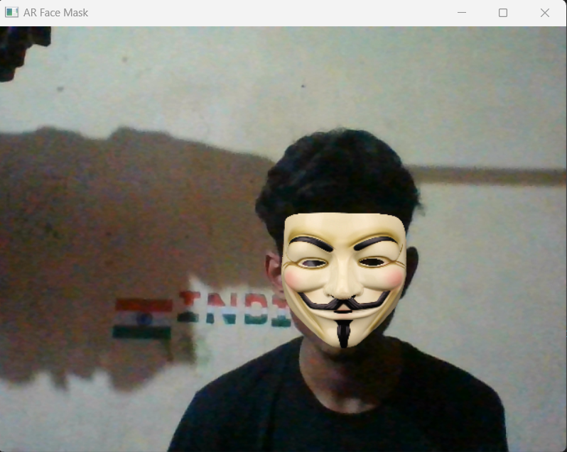

# Face Mask AR

Face Mask AR is a Python program that detects faces in a live video stream and augments them with a mask image. This provides a fun and interactive way to try on different masks virtually.

## Requirements

- Python 3
- OpenCV library (`pip install opencv-python`)
- Haar cascade XML file for face detection (e.g., `haarcascade_frontalface_default.xml`)  taken from `https://github.com/kipr/opencv/blob/master/data/haarcascades/haarcascade_frontalface_default.xml`
- Mask image with transparency (RGBA format)

## Usage

1. Clone the repository or download the Python script and the required image files.

2. Install the necessary libraries by running the following command in the terminal:
```pip install opencv-python```

3. Place the Haar cascade XML file (`haarcascade_frontalface_default.xml`) and the mask image (e.g., `mask.png`) in the same directory as the Python script.

4. Run the Python script in a terminal or IDE:
```python face_mask_ar.py```

5. The program will open a window showing the live video stream from your default webcam. It will detect faces in the video and augment them with the selected mask image.

6. To choose a different mask, press the "Q" key to exit the program and update the `mask.png` file with your desired mask image.

## Screenshots


*Example screenshot of the program displaying the live video stream with a detected face and a mask augmented on it.*


## Notes

- Ensure that your webcam is properly connected and accessible by the program.
- Experiment with different mask images to achieve the desired augmented reality effect.
- Adjust the face detection parameters in the script (e.g., scale factor, minimum neighbors) for better face detection results if needed.


